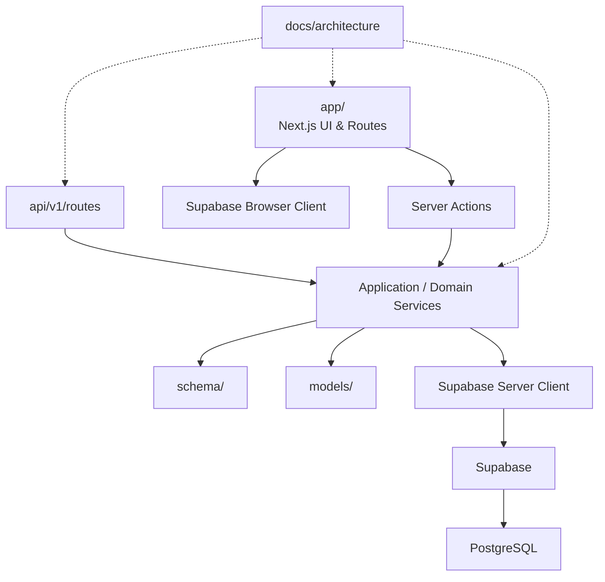

<!-- BEGIN:nextjs-agent-rules -->
# This is NOT the Next.js you know
This version has breaking changes — APIs, conventions, and file structure may all differ from your training data. Read the relevant guide in `node_modules/next/dist/docs/` (resolved from this file's directory; in monorepos the `next` package may not be visible from the repo root) before writing any code. Heed deprecation notices.
This block is written and re-added by `next dev` — verify at `node_modules/next/dist/server/lib/generate-agent-files.js`. Removing it from a diff only re-creates the uncommitted change; committing it with your work keeps the tree clean.

<!-- BEGIN:Project Rules and Structure -->
# This is a chess interface, aimed to provide individuals with the facility to play, learn & compete in the said e-sport.
## Project Overview

This project is a TypeScript application built with:

Next.js App Router
React
Supabase
PostgreSQL
TypeScript
ESLint

The architecture separates presentation, HTTP/API concerns, domain/application logic, validation, and infrastructure.

Agents must preserve these boundaries when adding or modifying code.
<!-- END:Project Rules and Structure -->

<!-- BEGIN:Architecture -->
Architecture


# Layer responsibilities
## app/

Next.js presentation and routing layer. use for:
- Pages
- Layouts
- Loading/error states
- Route-specific components
- Server Actions
- UI composition

Do not place reusable database logic directly inside pages.

Prefer:
app/users/page.tsx -> lib/services/users.ts -> lib/supabase/server.ts

rather than:
app/users/page.tsx -> supabase.from(...)

for non-trivial operations.

# api/v1/routes/

HTTP API layer.

Use for:
API routes should remain thin.

Preferred flow:
HTTP Request -> Route Handler -> Validation -> Service / Domain Logic -> Supabase -> Response

Do not duplicate business logic between API routes and Server Actions.

# lib/

Infrastructure and application services.

Recommended structure:

```bash
  lib/
  ├── supabase/
  │   ├── client.ts
  │   ├── server.ts
  │   └── proxy.ts
  ├── services/
  ├── auth/
  ├── utils/
  └── integrations/
```

Use lib/services/ for reusable application operations.

Example:
```bash
lib/services/users.ts
lib/services/inventory.ts
lib/services/orders.ts
```

Services may use Supabase clients and domain models but should not contain UI concerns.

# models/

Contains domain/application models and shared TypeScript types.

Examples:
```bash
  models/
  ├── user.ts
  ├── product.ts
  ├── inventory.ts
  └── order.ts
```

Do not treat these as ORM models.

This project uses Supabase/PostgreSQL directly rather than introducing an ORM unless there is a documented architectural reason to do so.

Prefer generated Supabase database types for database representations.

# schema/

Contains validation and serialization schemas.

Use Zod for runtime validation.

Example:
```bash
  schema/
  ├── auth.ts
  ├── user.ts
  ├── product.ts
  └── pagination.ts
```
Schemas should validate:

- API request bodies
- Query parameters
- Form inputs
- Server Action inputs
- External API responses when necessary

Never assume TypeScript types alone provide runtime validation.

# docs/architecture/

Contains architectural documentation.

Recommended:
```bash
  docs/architecture/
  ├── overview.md
  ├── authentication.md
  ├── database.md
  ├── api.md
  └── adr/
```

Architectural decisions that significantly affect the codebase should be documented Architecture
<!-- END:Architecture -->

<!-- END:nextjs-agent-rules -->
